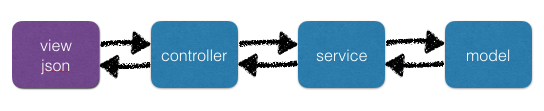

# Modern Web 2016：Backend Testing Dojo

## 使用者登入需求描述

使用者可以透過電子郵件，並且需要輸入密碼，完成登入的功能，確保個人資料能被保護

## 練習目標

期望透過此練習，讓大家體驗 TDD 實施的要領，經由單純的使用者登入功能實作引領大家完成第一個 TDD。

## 練習方式

使用 [Sails.js (MVC Framework for Node.js)](http://sailsjs.org/) 作為此次練習的框架，Sails 為 MVCS（Model, View, Controller, Service）架構，是 MVC 的延伸，分層的好處除了程式碼責任清楚之外，也利於分工，在 test 撰寫上，也較能清楚切分驗證範圍。

